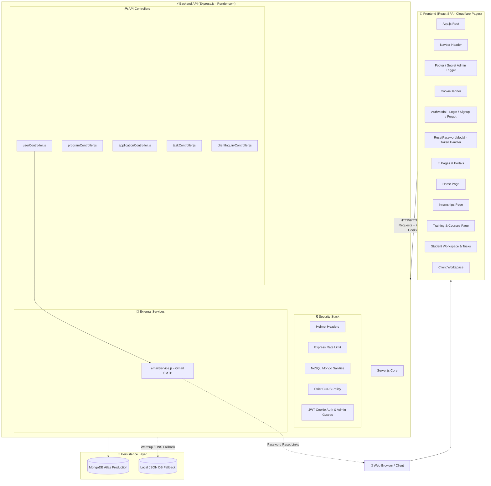
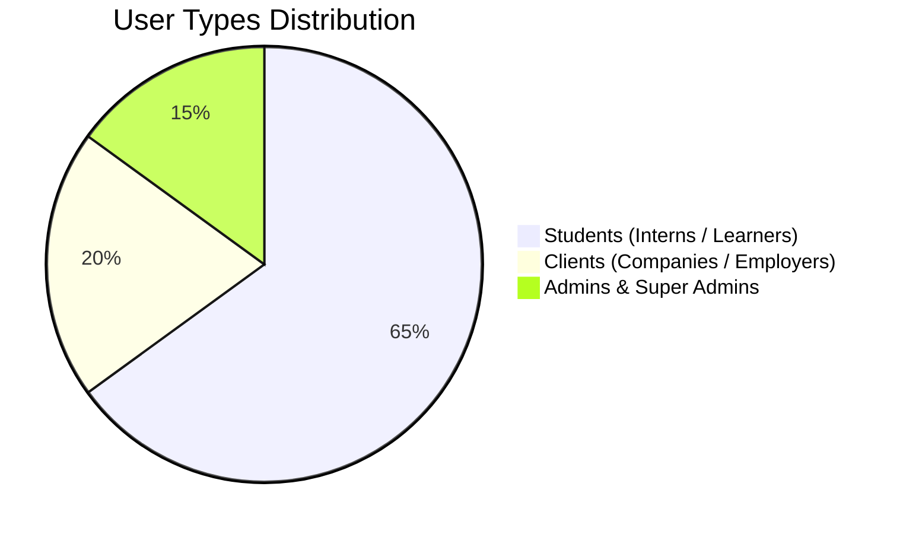
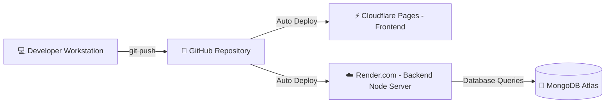

# 🧠 Velora Global — Project Architecture & Mental Map (`info.md`)

> **Velora Global** is an enterprise-grade MERN-stack platform providing tech internships, industry training, and client project deliverables.

---

## 🗺️ High-Level System Architecture (Mental Map)



---

## 📁 Repository Structure & Directory Map

```
Company/
├── info.md                      # 👈 System Mental Map & Complete Documentation
├── backend/                     # Node.js + Express REST API
│   ├── .env                     # Environment variables (DB, Secrets, SMTP)
│   ├── server.js                # Express entry point & middleware initialization
│   ├── db.js                    # Database connection manager (MongoDB Atlas + Local Fallback)
│   ├── controllers/             # Business logic handlers
│   │   ├── userController.js    # Auth, session management, bcrypt, password reset
│   │   ├── programController.js # Internship & training program CRUD
│   │   ├── applicationController.js # Student application processing
│   │   ├── taskController.js    # Student task & deliverable assignments
│   │   └── clientInquiryController.js # Client project inquiries
│   ├── middleware/
│   │   └── authMiddleware.js    # Require Admin & Session authentication guards
│   ├── models/                  # Mongoose DB Schemas
│   │   ├── User.js              # User schema (Students, Clients, Admins, Superadmins)
│   │   ├── Program.js           # Program schema
│   │   ├── Application.js       # Application schema
│   │   └── Task.js              # Task schema
│   ├── routes/                  # Express Router definitions
│   │   ├── userRoutes.js        # /api/users
│   │   ├── programRoutes.js      # /api/programs
│   │   ├── applicationRoutes.js  # /api/applications
│   │   ├── taskRoutes.js         # /api/tasks
│   │   └── clientInquiryRoutes.js # /api/client-inquiries
│   └── services/
│       └── emailService.js      # Nodemailer SMTP engine (Branded HTML Reset Emails)
│
└── frontend/                    # React 18 Single-Page Application
    ├── public/
    │   └── index.html           # Main HTML with CSP & Security Meta Headers
    └── src/
        ├── App.js               # Root component, global state, router tab manager
        ├── App.css              # Glassmorphism design system & micro-animations
        ├── components/          # Reusable UI components
        │   ├── Navbar.js        # Sticky Header with Role-aware Workspace navigation
        │   ├── Footer.js        # Footer with links & hidden Super Admin trigger
        │   ├── CookieBanner.js  # Animated GDPR-compliant Cookie Consent Banner
        │   ├── ResetPasswordModal.js # Interactive Password Reset token modal
        │   ├── NotificationToast.js # Custom animated alert/notification system
        │   └── CertificateModal.js   # Official QR Certificate viewer
        ├── pages/               # Views & Role Workspaces
        │   ├── Home/            # Landing page, stats, hero, services, founders
        │   ├── Auth/
        │   │   └── AuthModal.js # Unified Auth Modal (Login / Signup / Forgot Pw)
        │   ├── InternshipsPage/ # Internship Domain Explorer & Application Modal
        │   ├── TrainingPage/    # Professional Courses & Skill Programs
        │   ├── StudentPortalPage/# Student Workspace, Tasks, Learning Modules
        │   └── ClientPortalPage/# Streamlined Client Workspace & Inquiry Details
        └── services/
            └── api.js           # Fetch API wrapper with credentials: 'include'
```

---

## 🔐 Security Architecture & Hardening

| Layer | Technology / Implementation | Details |
|---|---|---|
| **Password Protection** | `bcryptjs` (12 rounds) | All user passwords hashed before DB storage. Legacy plain-text passwords auto-upgrade upon successful login. |
| **Session Cookies** | `HttpOnly`, `SameSite=Lax` | Session stored in `velora_refresh_token` cookie (30 days). JavaScript cannot access token (prevents XSS theft). |
| **LocalStorage Cleanliness** | Minimal profile data only | Stripped all sensitive tokens from `localStorage`. Stores only safe public fields (`name`, `email`, `role`). |
| **Password Reset** | Crypto + Nodemailer | Generates 32-byte crypto token. Stores SHA-256 hash in DB with 1-hr expiration. Raw token sent via branded Gmail HTML email. |
| **API Rate Limiting** | `express-rate-limit` | Strict rate limit on sensitive endpoints (`/api/users/login`, `/api/users/forgot-password`). |
| **NoSQL Injection Defense** | `express-mongo-sanitize` | Strips `$` and `.` operators from user input in body/query. Sanitizes all search regex inputs. |
| **HTTP Security Headers** | `helmet` | Sets `X-Content-Type-Options`, `X-Frame-Options`, `X-XSS-Protection`, Strict Referrer Policies. |
| **Access Control Guards** | `requireAdmin` middleware | All sensitive user management and administrative endpoints strictly guarded against non-admin roles. |

---

## 🔑 User Roles & User Types



1. **Student / Intern Candidate** (`userType: 'student'`):
   - Access to Internship Domain Explorer and Training Programs.
   - Student Portal workspace for tracking application status, assigned tasks, and learning materials.
2. **Client** (`userType: 'client'`):
   - Clean, streamlined Client Workspace.
   - Client inquiry submission and project tracking basic details.
3. **Admin & Super Admin** (`userType: 'admin'` / `'superadmin'`):
   - Access to user management, assigning student tasks, reviewing candidate applications, and creating new programs.
   - Accessible via secret key combination (`Ctrl + Alt + Shift + A`) or hidden footer access.

---

## 🔑 Key API Endpoints Reference

### 👤 User & Authentication Routes (`/api/users`)
- `POST /api/users/login` — Log in user & set `velora_refresh_token` HttpOnly cookie.
- `POST /api/users/logout` — Clear session cookie & revoke session.
- `GET /api/users/me` — Auto-sync current logged-in user from session cookie on page refresh.
- `POST /api/users/register-student` — Register new Student account.
- `POST /api/users/register-client` — Register new Client account.
- `POST /api/users/register-admin` — Register Super Admin account (requires `ADMIN_SECRET_KEY`).
- `POST /api/users/forgot-password` — Generate reset token & email reset link.
- `POST /api/users/reset-password` — Reset password using token from email.

### 📚 Program Routes (`/api/programs`)
- `GET /api/programs` — Fetch available internship & training programs with domain/search filtering.
- `GET /api/programs/:id` — Fetch details for a specific program.
- `POST /api/programs` — Create new program (*Admin only*).

### 📋 Application Routes (`/api/applications`)
- `POST /api/applications` — Submit internship application.
- `GET /api/applications/user/:userId` — Fetch user's submitted applications.

---

## ⚙️ Environment Variables Setup (`backend/.env`)

```env
PORT=5000
MONGODB_URI=mongodb+srv://<username>:<password>@cluster0.../velora_global?retryWrites=true&w=majority
ADMIN_SECRET_KEY=VELORA_SUPER_ADMIN_2026

# Production Deployment Settings
NODE_ENV=production
CLIENT_ORIGIN=https://velora-global.pages.dev

# Password Reset (Gmail SMTP)
EMAIL_USER=your-email@gmail.com
EMAIL_PASS=your-16-char-app-password
```

---

## 🚀 Deployment Overview



* **Frontend Hosting**: Cloudflare Pages (`https://velora-global.pages.dev`)
* **Backend Hosting**: Render.com Web Service (`https://velora-global-backend.onrender.com`)
* **Database**: MongoDB Atlas Cloud Cluster (`velora_global`)

---

*Document created for **Velora Global**. All components, routes, and security configurations are fully aligned.*
